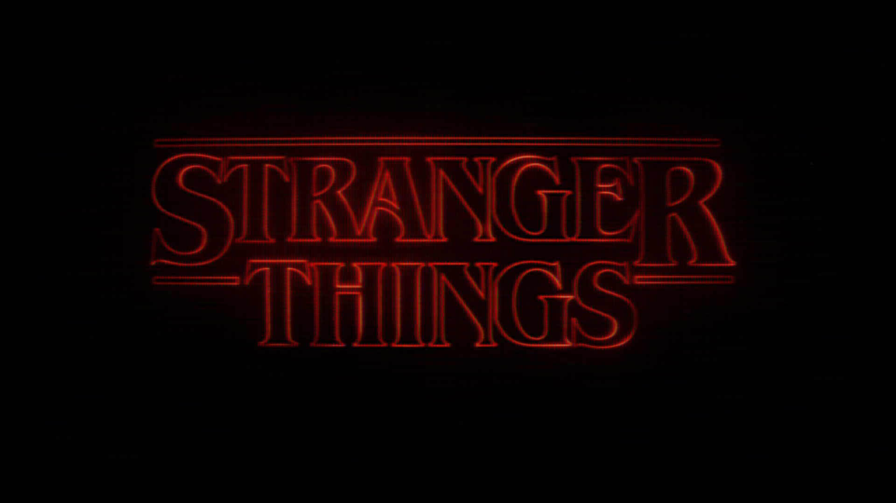
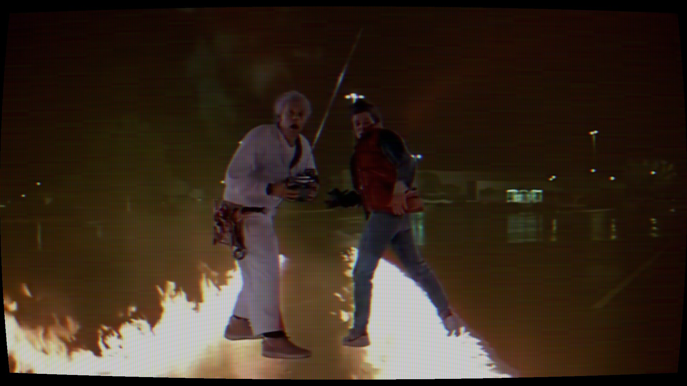
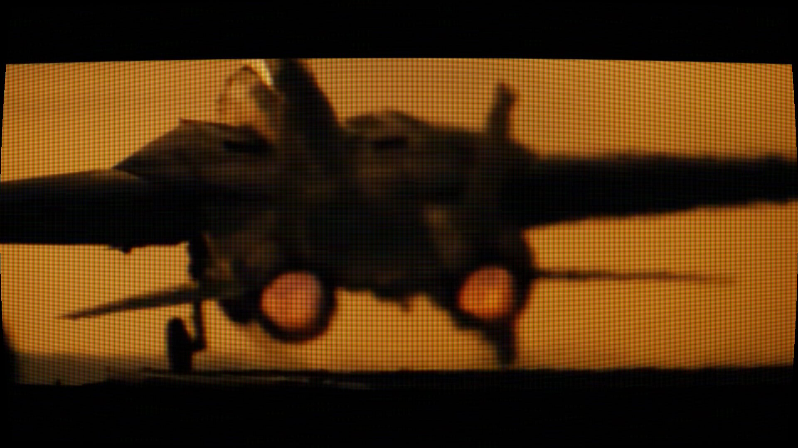
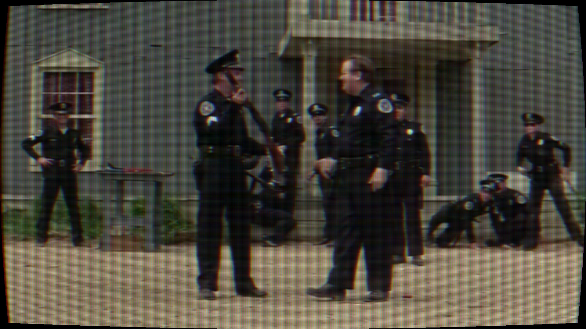

# FieldStation42-VHS-MPV-Shaders
A collection of MPV GLSL shaders that recreate the look of mid and early 80s CRT televisions, VHS tapes, and analog broadcast video. Developed for the FieldStation42 retro TV project with  focus on authenticity rather than exaggerated VHS effects.

# Recommended Shader Order

For the intended FieldStation42 analog video pipeline, use the shaders in the following order:

1. Chroma_noise.glsl
2. VHS_blur.glsl
3. noiseV2.glsl
4. tracking.glsl
5. VHSv1.1.glsl
6. colorbleed.glsl
7. crt.glsl

This order reproduces the analog signal chain used in the FieldStation42 project.

Signal flow:

Digital Video
        ↓
RF Chroma Interference
        ↓
VHS Blur
        ↓
Tape Noise
        ↓
Tracking Errors
        ↓
VHS Signal Processing
        ↓
Color Bleed
        ↓
CRT Display
### The shader order is intentional. Changing the order will significantly alter the final image.

## Acknowledgements and Credits

These shaders were developed with the assistance of ChatGPT.

The overall design, effect tuning, testing, debugging, and final implementation were done by me.

## You can change speed,intensity and more inside of each .glsl file 

(e.g. ##define speed 2.5)

## Preview

